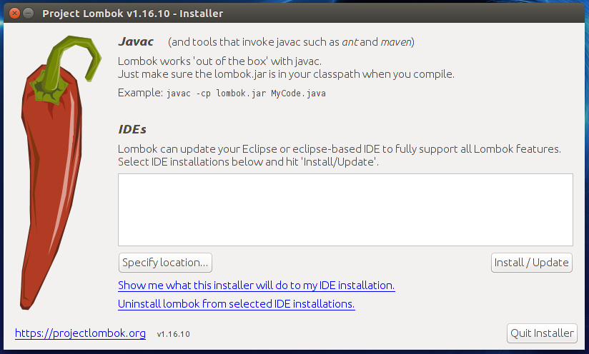

= Faster development and concise code with Lombok in Java project
Imteyaz Ahmad <imteyaz.ahmad@talentica.com>

== About the Author

You can contact {author} at {email}.

== Installing Lombok

=== Eclipse
  1. Download Lombok from https://projectlombok.org/download.html.
  2. Run it by double clicking on it or by firing java -jar lombok.jar.
  3. It will open an explorer window like shown as below:
  
  4. Point to folder containing Eclipse by clicking Specify Location..
  5. After that, click on Install/Update
  6. Once installation is done...add Lombok dependency in the project and restart Eclipse.
    If it is not working then, you have to start Eclipse by firing `$ECLIPSE_HOME/eclipse --clean`.

=== IntelliJ
Here is a plugin and installation instructions https://github.com/mplushnikov/lombok-intellij-plugin

== Using Lombok

Add `lombok.jar` in your Java project, either using Maven, Gradle or any other build tools. Below is a sample `build.gradle` file.
[source,gradle,indent=4]
dependencies {
    ........
    compile group: 'org.projectlombok', name: 'lombok', version: '1.16.10'
    ........
}

== Annotations Provided by Lombok

=== @Getter and @Setter

[source,java,indent=4]
package com.imti.lombok;
@Getter
@Setter
public class GetterSetterLombok {
    private String name;
    private String message;
}

This will generate `public` getter/setter for every non-static field. If you want to define access level, it can be done by specifying `AccessLevel`

e.g.: `@Setter(AccessLevel.PROTECTED) private String name;`

If you do NOT want to generate getter/setter for a particular field, then you can disable it by invoking `AccessLevel.NONE`.

[source,java,indent=4]
package com.imti.lombok;
@Getter
@Setter
public class GetterSetterLombok {
    @Setter(AccessLevel.NONE)
    private Long id;
    private String name;
    private String message;
}

=== @ToString
By default, all non-static field will be included. If you want to exclude any, define them in `exclude` parameter.
[source,java,indent=4]
package com.imti.lombok;
//This will print value of all fields except id (excluded) and STATIC_VAR(static field).
@ToString(exclude="id")
public class HelloLombok {
	private static final int STATIC_VAR=10;
	private String id;
	private String name;
	private String message;
}

Here is test class for the same.

[source,java,indent=4]
public class HelloLombokTest {
    @Test
    public void testToString(){
        HelloLombok helloLombok = new HelloLombok();
        helloLombok.setId("imti");
        helloLombok.setMessage("Hello Lombok!");
        helloLombok.setName("Imteyaz");
        System.out.println(helloLombok.toString());
    }
}

Output of this test is: +
`HelloLombok(name=Imteyaz, message=Hello Lombok!)`

Note: If you, by mistake, typed name of non-existing field, it will generate a warning!

[source,java,indent=4]
package com.imti.lombok;
import lombok.Getter;
import lombok.Setter;
import lombok.ToString;
//Created by imteyaza on 3/8/16.
@Getter
@Setter
@ToString(exclude = {"id", "name","hell"})
public class HelloLombok {
    private static final int VALUE = 10;
    private String id;
    private String name;
    private String message;
}

This will generate a warning `The field 'hell' does not exist`

=== @Log
For using any logging library, configure it as per the instructions by provider,then use it's annotation. for example for Log4j2, we will use `@Log4j2`

[source,java,indent=4]
@Log4j2
public class HelloWorld {
	private String name;
	public static void main(String args []){
		log.info("Inside the main method");
	}
}

It creates following line for you +
`private static final org.apache.logging.log4j.Logger log = org.apache.logging.log4j.LogManager.getLogger(HelloWorld.class);`

For other supported logging library, please refer to https://projectlombok.org/features/Log.html

=== @Cleanup (My favourite)

[source,java,indent=4]
package com.imti.lombok;
import lombok.Cleanup;
import java.io.*;
//Created by imteyaza on 3/8/16.
public class ResourceCleanupLombok {
    public void readFile(String inputFileName, String outputFileName) throws IOException {
        @Cleanup InputStream inputStream = new FileInputStream(inputFileName);
        @Cleanup OutputStream outputStream = new FileOutputStream(outputFileName);
        byte[] buffer = new byte[1024];
        while (true) {
            int line = inputStream.read(buffer);
            if (line == -1) {
                break;
            }
            outputStream.write(buffer, 0, line);
        }
    }
}

[%hardbreaks]
By default it looks for a method called `close()` in the type of Object you are cleaning up.If you have a custom method name, it can called as `@Cleanup("destroy")`.
[red]#CAUTION#  `The destroy() method must be a non-argument method.`

=== Conclusion
These were some of the features provided by Lombok. Here is a link to list of all features- `https://projectlombok.org/features/index.html`

== References
* Project Page:  https://projectlombok.org/index.html
* Download and installation instructions: https://projectlombok.org/download.html
* IntelliJ plugin and installation instructions: https://github.com/mplushnikov/lombok-intellij-plugin
* Sample application: https://github.com/ahmadimt/JavaWithLombok
